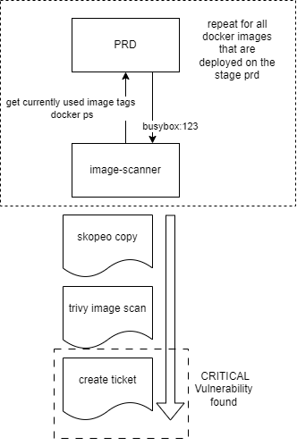

# image-scanner

To ensure that all active used images (those with containers on PROD system) continue to be protected from security problems, a regular check using trivy is required.

For this script, a Docker image with necessary dependencies was created ([Dockerfile](https://git.primeo-energie.ch/docker/trivy-docker-images/)).

The `notification.sh` file is also used in [security-checker](https://git.primeo-energie.ch/platform/security-checker/) because the notification algorithm is implemented the same way.

## Functions



### Excluding images

You can save a `.exclude` file in the suppression tree (starting directory with name from `TRIVY_SUPPRESSION_TREE_PATH`; Default: suppression).

The image name is normalized by the rules in script.sh ("normalize_image_name"): So for the suppression path, please delete any ports and replace ":" and "@" with "/".

```text
# Example tree (with cmd `tree /F suppression`)
IMAGE-SCANNER\SUPPRESSION
└───dck-public.primeo-energie.ch
    ├───postgres
    │       .exclude
    │
    └───primeo-energie
        ├───additional-offers
        │       .exclude
        │
        └───birthday-email
            └───218b41c0
                    .exclude

# Excluded images:
# dck-public.primeo-energie.ch/postgres:12.15-alpine3.18
# dck-public.primeo-energie.ch/postgres:12-alpine
# wildcard: dck-public.primeo-energie.ch/postgres*
# dck-public.primeo-energie.ch/primeo-energie/additional-offers:91c036ab
# wildcard: dck-public.primeo-energie.ch/primeo-energie/additional-offers*
# dck-public.primeo-energie.ch/primeo-energie/birthday-email:218b41c0
```

## Install notes in GitLab

- Set ci/cd job timeout to 10h
- [Required variables](#required-variables)
- Set pipeline schedules

## Documentation of variables

You can configure this script with environment variables.

### Required variables

- GITLAB_ISSUE_CREATE_TOKEN

### Optional variables (see value in .gitlab-ci.yml)

- `APP_NAME` (Default: image-scanner)
- `IMAGE_VERSION`: (Default: ff1838cb)
- `DOCKER_NAME`: (Default ${DOCKER_NAMESPACE}/trivy-docker-images)
- `DOCKER_REPO_URI`: (Default: repo.primeo-energie.ch:5000)
- `LOG_FILE`: (Default: trivy_scans.log)

- `GITLAB_URL`: (Default: git.primeo-energie.ch)
- `GITLAB_ISSUE_REPO_TARGET`: GitLab Repo id for tickets
- `GITLAB_ISSUE_ASSIGNEES`: comma-separated list of GitLab assignees ids for tickets

- `TRIVY_SUPPRESSION_TREE_PATH`: (Default: suppression)
- `TRIVY_REPORT_PATH`: (Default: overall_reports)
- `CVE_PATH`: (Default: cve_metadata)
- `MAX_ARTIFACT_SIZE`: Maximum artifact size in MB in [GitLab Admin](https://git.primeo-energie.ch/admin/application_settings/ci_cd) or custom value in [GitLab Repo](https://git.primeo-energie.ch/platform/image-scanner/-/settings/ci_cd) (Default: 500)

## Purge all tickets

> :warning: **This will delete all GitLab issues with the application prefix in title**: Be very careful here!

For purging all tickets you can run `purge_all_notification` job with custom environment variable `FORCE_PURGE` set to `true`.

## References

- https://git.primeo-energie.ch/ex_rboehm/docker-scan-poc/-/blob/master/.gitlab-ci.yml
- https://git.primeo-energie.ch/templates/file-templates/-/blob/master/gitlab-ci/compose_gitlab-ci.yml
- How to find all image tags of a running docker container: https://stackoverflow.com/a/56649332
- Where can I find the sha256 code of a docker image: https://stackoverflow.com/a/33511811
- Open issue: auto-generated digest differs from the real manifest: https://github.com/containers/image/issues/1049
